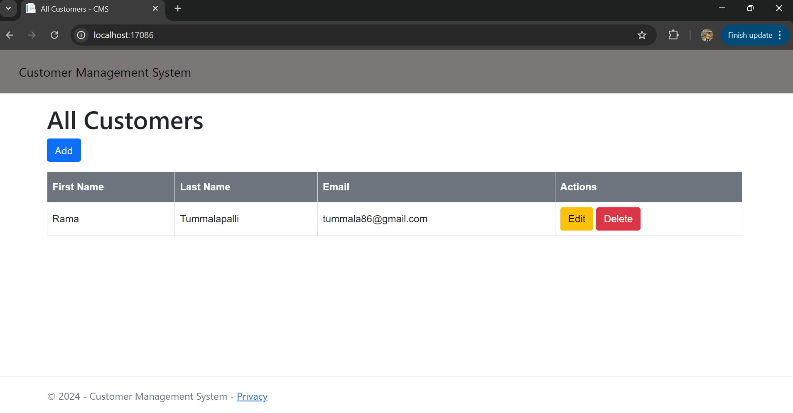

# Customer Management System
The Customers solution contains 2 projects

- Customers.API
- Customers.Web

The API service hosts the following endpoints.

```
-- Health Check --
GET /up

--  Customers --
GET /v3/customers  - Get all customers list
GET /v3/customers/{id} - Get customer by id
POST /v3/customers/add - Create customer
PUT /v3/customers/update - Update customer
DELETE /v3/customers/{id} - Delete customer (soft delete)
```

The web application used to manage customers information.




## Prerequisites

This project relies on the following dependencies:

* [.NET 7](https://dotnet.microsoft.com/en-us/download/dotnet/7.0)
* [Entity Framework Core](https://learn.microsoft.com/en-us/ef/core/providers/in-memory/?tabs=dotnet-core-cli)
* [Docker](https://www.docker.com/) (optional, required for running the project in Docker).

## Clone Instructions
Clone the code into your local using the below command:
Clone the project:
```sh
$ git clone https://github.com/tummala86/customers.git
```

There are two ways to run this project:
1. You could open the solution directly in Visual Studio and run the Customers.API and Customers.Webapp. You can run the Tests from Test-->Run All Test Menu.

2. You can build the API and Webapp from the command line
Build and run (from the project directory):

Terminal 1: 
```sh
$ dotnet build
$ dotnet run --project .\Customers.API\Customers.API.csproj
```

Terminal 2:
```sh
$ dotnet build
$ dotnet run --project .\Customers.Webapp\Customers.Webapp.csproj
```

To run tests:
```sh
$ dotnet test
```

## Assumptions

- I used in-memory data store temporarly to test the functionality. In real time I would use MS Sql high scalable and performance database.
- No data validations added as part of this test (i.e duplicate email and name checks). I would add validation based on business requirements.

## Areas for Improvements

- Introduce JWT Authentication on API endpoints.
- I would implement custom Idempotency in real time. To avoid duplicate customer records insertion.
- Improve exception handling and logging to trace the issues quickly. I would use Elastic search to store logs for quicker search and visualisations.
- I would use Graphana to monitor service availability.
- Implementing resilience mechanisms by introducing [Polly](https://github.com/App-vNext/Polly#polly).
- I would use Honeycomb to trace requests.
- I would implement rate limiting to limit the number of requests.
- I would implement end to end tests on all endpoints to find out intermittent issues in all environments.
- I would implement load tests to find out the application peformance.
- I would add more unit and integration tests to cover all parts of source code.
- Ensure that persisted PCI and PII information is securelly encrypted.
- Ensure that any PCI and PII information logged is masked.
